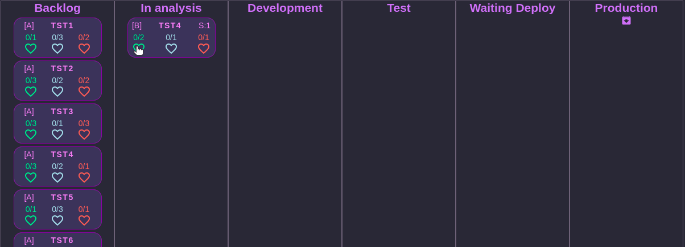
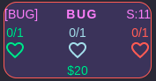

  

# Rules of game

1. Each day is one round
2. Deploy is only allowed on tuesdays and thursdays
3. Every friday is allowed to buy an upgrade
4. Projects, Employees and Bug Cards have a cost then calculated daily
5. Bug Cards are the only cards that have a cost
6. Cards need apply point's of analysis(green), development(blue) and test(red)
7. Cards that are in production can be archived

  

